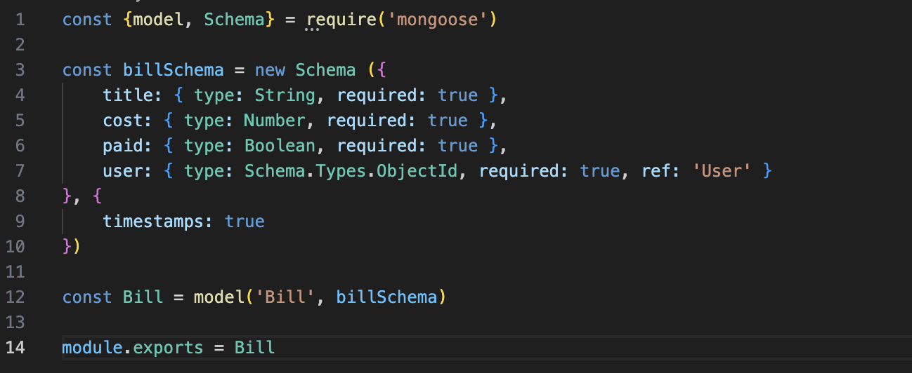

BUDGET API

This app helps manage bills. Shows you which bills are paid and which ones have not been paid.

You would need
-Visual Code
-Github account
-MongoDB account

Steps (*)
1.Terminal Setup
2.Building Models & Controllers & Routes for users
3.Building Models & Controllers & Routes for bills 
4.Postman: user
5.Postman: Bills
6.Testing

1.TERMINAL SETUP
*Go into your terminal
*Make a new directory
*cd into the new directory
*touch server.js
*npm init -y
*npm i express mongoose dotenv morgan bcrypt jsonwebtoken
*touch app.js
*touch .env .gitignore
*git init
*code . (to open up vs code)
*make three seperate folder of controllers, models, and routes
*in .gitignore file add node_modules/ and on the next line add .env
*add your mongo link to the .env tab (MONGO_URI=yourLink)
*goto https://emn178.github.io/online-tools/sha256.html and write a key in the first big box
*copy the hash in the secound bigbox
*write SECRET= pasteHash
*goto package.json add a comma after "start": "node server.js" and make a new line and write "dev": "nodemon"
*go to server.js
*
*go to app.js
*

2.BUILDING MODELS & CONTROLLERS & ROUTES FOR USERS
-touch models/user.js
-touch controllers/user.js
-go into the user.js file in the models folder
-
-
-goto the user.js file in the controllers folder
-
-
-add a new route folder
-touch routes/userRoutes.js
-go in to the userRoutes.js file
-

3.BUILDING MODELS & CONTROLLERS & ROUTES FOR BILLS
*touch models/bill.js
*go into the bill.js file in the models folder
*
*touch controllers/bills.js
*goto the bills.js file in the controllers folder
*
* add a } on line 62
*touch routes/bills.js
*go in to the bills.js file in the routes folder
*

4.POSTMAN: USER
-follow the steps from the image to test user login with postman
-
-Click on send
-testing login you would want to add /login to the url you already have
-Click on send
-tesing for update first copy the numbers between the quote by the id(example shown in the image below)

-replace login with the numbers that were copyed in the url
-change the name, email and password to something different
-change post to put
-copy the token
-go to Authorization and change the type into Bearer Token 
-post the token
-Click on send
-tesing for delete by switching from put to delete
-Click the send button

5.POSTMAN: BILLS
-follow the steps from the image to test user login with postman
-
-change users to bills in the url 
-copy the token
-go to Authorization and change the type into Bearer Token 
-post the token
-go back to body and delete the name, email and password
-add {
    "title": "rent",
    "cost": "1400",
    "paid": "true"
}
-Click on send
-to test the list of unpaid bills, change post to get
-Click on send
-to test the list of paid bills add /paid to the url
-Click on send
-to test the delete, update and show the id would need to be copied and paste in place of paid
-for delete change the get to delete, for update change to put, and for show change to get
-Click on send

6.TESTING
-in terminal put npm i -D jest supertest mongodb-memory-server artillery@1.7.9
-go into package.json and add 
"jest": {
  "testEnvironment": "node"
}
-add a new folder called tests
-add a user.test.js file in the tests folder
-go into the user.test.js file
-
-
-
-add a bill.test.js file in the tests folder
-go into the bills.test.js file
-
-
-

Clone repository to your computer
-Click on code(green button)
-copy ssh link
-go to terminal
-cd in software_classwork
-cd in unit_2 
-git clone link
-ls
-cd budgeting-api
-code .